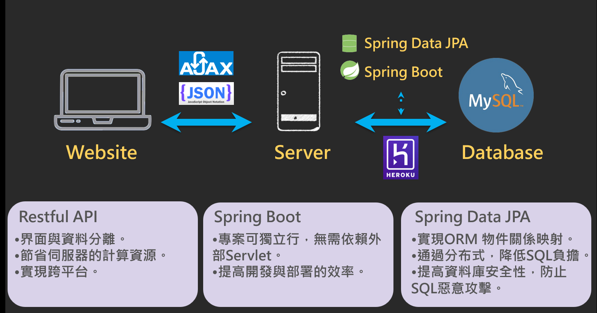
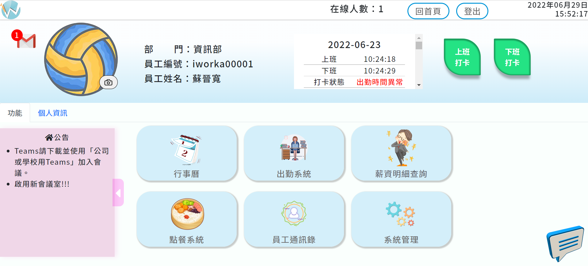

# i上班公司管理系統  
### 專題簡介 
「i上班公司管理系統」擁有多種公司管理項目功能:
1. 支援Google Maps定位上下班打卡(Geolocation API實現遠距打卡) 
2. 使用FullCalendar排班行事曆，可從其中查詢過去的請假紀錄
3. 中午訂餐不麻煩，透過點餐系統完成下單及彙整訂單作業
4. 填寫月份、信箱並會將薪資單發送到信箱
5. 若有重要公告以WebSocket即時更新到網頁上，讓所有員工都能獲得最即時的消息
6. 登入/登出系統 (以JWT實現無狀態傳輸） 
7. 運用Apache POI API提供Java程式Office格式檔案讀和寫的功能

### 系統介紹
- 上班打卡
- 行事曆
- 點餐系統
- 出勤系統
- 系統管理
- 薪資寄送
- 公告欄
- 推播通知
- 員工通訊錄
  #### 架構說明
     
  #### 主畫面
  
